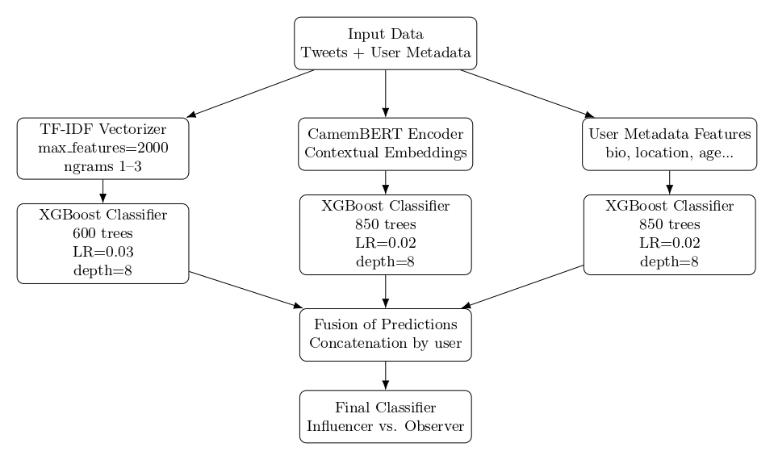

# Twitter User Classification: Influencer vs. Observer

Octave Rebourseau, Arthur Fournier, Aziz Berthé

## Overview
This repository contains a machine learning pipeline designed to classify Twitter users as either 'Influencers' or 'Observers' based on their tweet history and profile metadata. Developed as part of the CSC_51054 Deep Learning course at École Polytechnique, this project achieved an 84.9% accuracy on the Kaggle Leaderboard.

  

 **Figure 1 : 3-Headed Ensemble Architecture for Influencer Role Classification**

## Architecture
The final model utilizes a 3-headed ensemble architecture (`VotingClassifier`) to capture different levels of information:
1.  **Textual TF-IDF Pipeline:** Processes tweet content and user biographies using term frequency (up to 2000 features, n-grams 1-2) fed into an XGBoost classifier.
2.  **Contextual Deep Learning Pipeline:** Leverages **CamemBERT** (a French-language Transformer) to generate dense 768-dimensional semantic embeddings from text, processed by a dedicated XGBoost model.
3.  **User Profile Pipeline:** Focuses exclusively on user metadata (account age, location, profile completion indicators) to model long-term behavioral signals independently of isolated tweets.

## Key Technical Challenges Addressed
*   **Data Leakage Prevention:** Implemented a strict user-level splitting strategy (`GroupShuffleSplit`) to ensure tweets from the same user remain grouped, drastically reducing the disparity between local validation and public leaderboard results.
*   **High-Dimensional Data Handling:** Applied `MaxAbsScaler` to maintain sparsity in TF-IDF matrices while managing memory efficiently during XGBoost training.

## Tech Stack
*   **Machine Learning:** Scikit-learn, XGBoost
*   **Deep Learning / NLP:** PyTorch, Hugging Face Transformers (CamemBERT), NLTK
*   **Data Processing:** Pandas, NumPy, Regex
